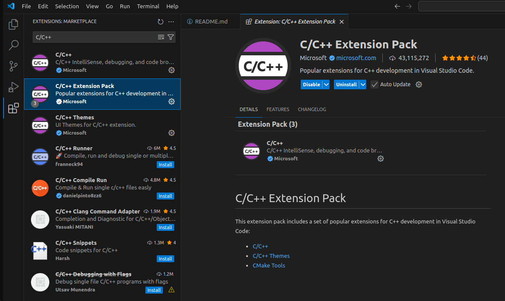
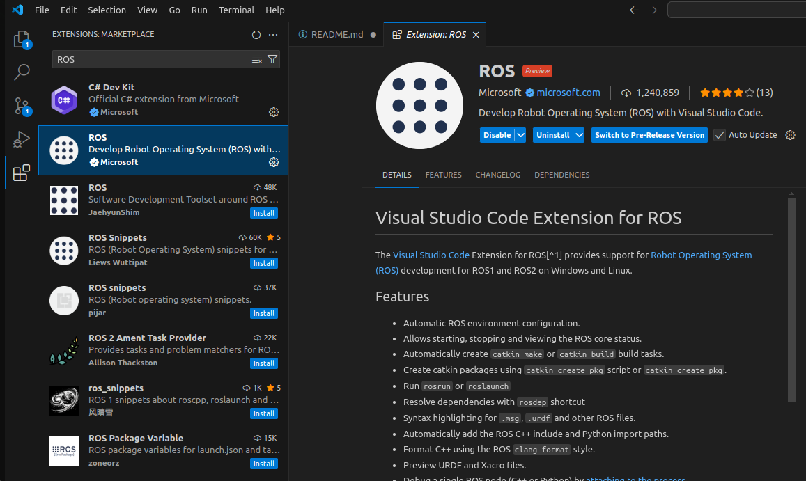
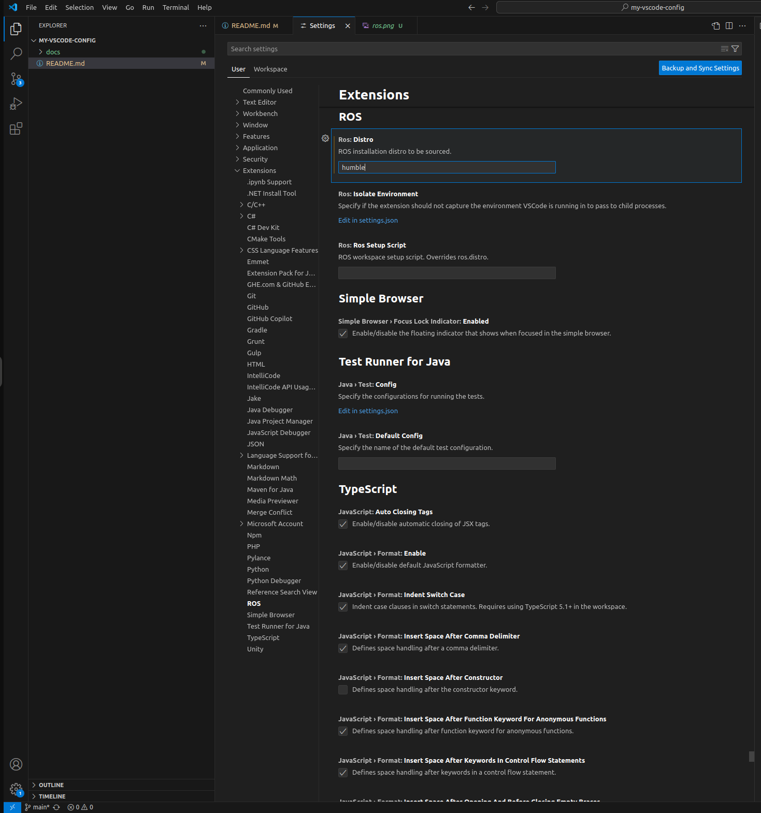
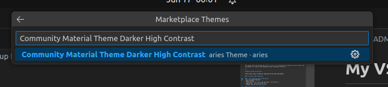
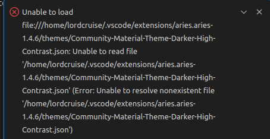
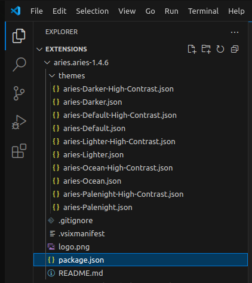
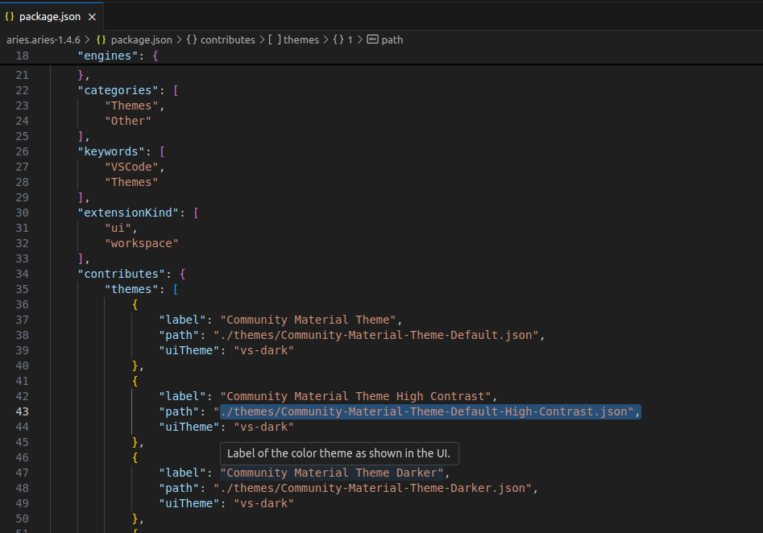
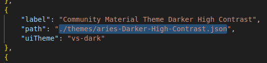

# My VS Code Setup Guide (Manual Setup)

This guide walks you through the **manual setup** of a customized and productive Visual Studio Code environment for robotics and embedded systems development workflows.

---

## Manual Setup Instructions

Follow these steps to manually replicate the VS Code environment.

### 1️⃣ Install Key Extensions

### ✅ C/C++ Extension Pack by Microsoft

- Open VS Code.
- Go to the **Extensions** tab (or press `Ctrl+Shift+X`).
- Search for: `C/C++ Extension Pack`
- Install the one from **Microsoft**.

### ✅ ROS Extension by Microsoft

- Still in the Extensions tab:
- Search for: `ROS`
- Install the one published by **Microsoft**.

---

### 2️⃣ Configure ROS Environment

- Click the ⚙️ **Gear icon** in the lower left.
- Go to **Settings**.
- Search for: `ROS`
- Find **ROS: Distribution**.
- Set it to your installed ROS version.
  - Example: `"humble"` (for ROS 2 Humble)

---

### 3️⃣ Install and Apply a Theme

#### 🎨 Color Theme

- Click the ⚙️ **Gear icon** → **Themes** → **Color Theme**
- Click **Browse Additional Color Themes**
- Search for: `Community Material Theme Darker High Contrast`
- Select and install it

Incase you get this issue below, keep calm, I solved it for you.



There is a mismatch between the expected theme filename and what's actually defined in the extension (I mailed the extension owners with no reply yet, the repo isn´t public so I could not sneak in a PR, but a local fix will do!).

Go to terminal

```sh
cd ~/.vscode/extensions/

code .

```
Then navigate to the package.json file



Change line 43 that specifies path from 

```sh
./themes/Community-Material-Theme-Default-High-Contrast.json"
```
to 
```sh
./themes/aries-Darker-High-Contrast.json
```





After this, you will have to close all instances of your vscode and then boot again. If you try to apply the theme, it might fail first and then vscode will ask you to reload extensions from disk as changes has been made.

---
### 4️⃣ File Icon Theme

- Click ⚙️ **Gear icon** → **File Icon Theme**
- Click **Install Additional File Icon Themes**
- Search for: `Material Icon Theme`
- Install and activate it

---

📝 Once you've completed this manual setup, your editor will be enhanced with intelligent code assistance, ROS integration, visually pleasing themes, and developer-friendly icons.

Next: [🔁 Automating This Setup (Portable Script)](#automating-this-setup)
